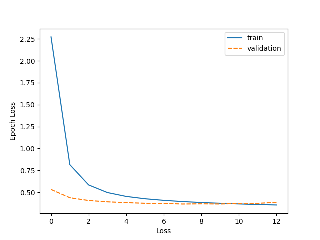
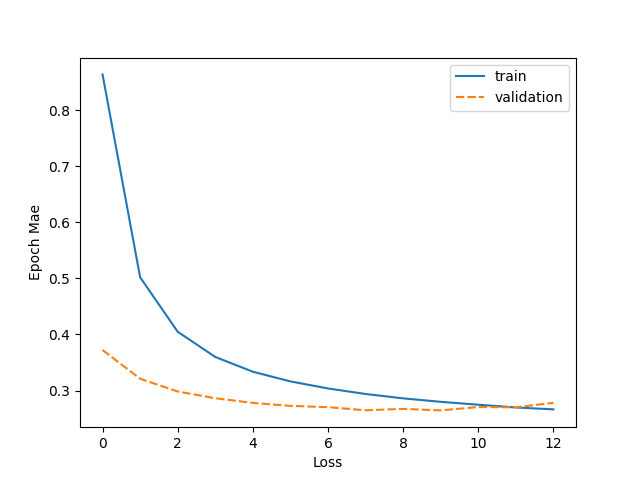
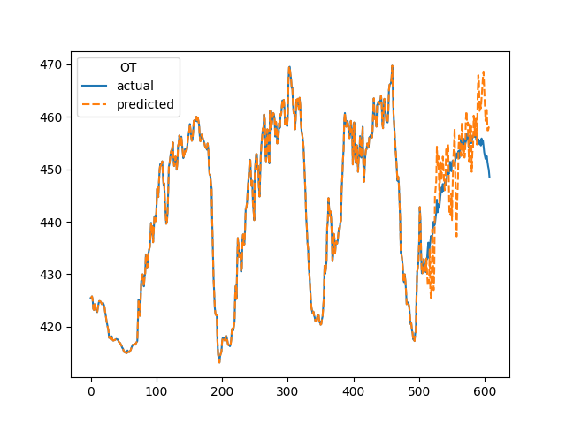

# TSMixer forecasting

This package is a demonstration of how to train and use [TSMixer](https://github.com/google-research/google-research/tree/master/tsmixer) for forecasting.

## Installation

```shell
pip install -e .[all]
```

Alternatively, you don't need to include any optional dependencies (i.e. `pip install -e .`)

## Datasets

To download the datasets either:

```shell
make datasets
```

## Training

To train the models as per the paper run:

```shell
make train-weather [out_dir="."]
make train-ETTm2 [out_dir="."]
make train-electricity [out_dir="."]
make train-traffic [out_dir="."]
```

To train the model with custom parameters, refer to the help via:

```shell
python3 -m tsmixer train --help
```

## Example

For the following example, we train on the weather dataset. Our losses and errors are as follow:

<!--{$ plot= tsmixer.utils.plot:plot_tensorboard_scalar("weather/logs", "epoch_loss")$}--><!--{{plot}}-->
<!--{><}-->
<!--{$ plot= tsmixer.utils.plot:plot_tensorboard_scalar("weather/logs", "epoch_mae")$}--><!--{{plot}}-->
<!--{><}-->

### Sample forecasts

Forecasts were run using:

```shell
make forecast out_dir="./weather"
```
<!--{$ plots = glob:glob("./weather/plots/*.png") $}-->
<!---->
<!--{$  plot= tsmixer.utils.plot:copy_and_markdown(path) $}-->
<!--{{ plot}}-->
<!---->
.png)

.png)

.png)

.png)

.png)

.png)

.png)

.png)

.png)

.png)

.png)

.png)

.png)

.png)

.png)

.png)

.png)

.png)

.png)

.png)


<!--{><}-->
